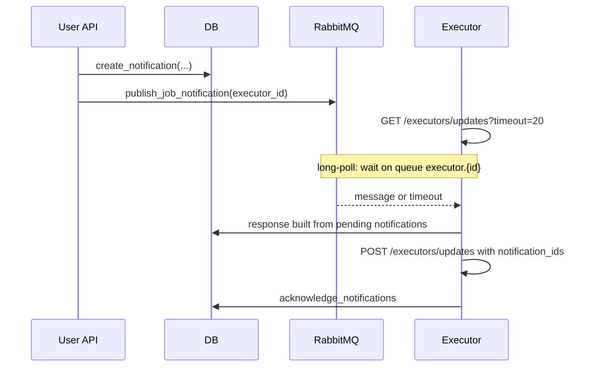

# Notification System API (Executor Reference)

This document describes how the ImagePod notification system works from the API perspective. It is the single reference for building an executor client that consumes notifications.

---

## Overview

The system has two channels:

1. **Persistent notifications** — Stored in the database and returned by `GET /executors/updates`. Each notification has an id, type, entity reference, and a payload snapshot.
2. **RabbitMQ** — Used only to wake long-poll. When a new job is enqueued or an endpoint is created/updated, the server publishes an empty message to a per-executor queue so that any waiting `GET /executors/updates` call returns promptly. The message carries no payload.

The **consumer** is the executor: it authenticates with an executor API key (Bearer) and calls executor-scoped endpoints to fetch and acknowledge notifications.

**Producers** are the user-facing APIs (jobs, endpoints, pods, volumes). When entities change, they call `create_notification()` to persist a notification for the owning executor. For job creation and endpoint create/update, they also publish to RabbitMQ so long-poll wakes up.



---

## Authentication

All notification-related endpoints live under `/executors` and require **executor authentication** (not user JWT).

- **Header**: `Authorization: Bearer <executor_api_key>`
- The executor API key is obtained when a user adds an executor: `POST /executors/add` (with user JWT). The response includes `api_key` and `executor_id`. The executor uses that `api_key` as the Bearer token for all executor-scoped calls.

---

## API Endpoints

| Method | Path | Purpose |
|--------|------|--------|
| GET | `/executors/updates` | Long-poll for up to `timeout` seconds (query param, max 60), then return all pending (unacknowledged) notifications for this executor. If RabbitMQ is connected and `timeout` > 0, the request blocks until a wake-up message arrives or the timeout elapses. Response: `{ "notifications": [ ... ] }`. |
| POST | `/executors/updates` | Acknowledge notifications by id. Request body: `{ "notification_ids": [ 1, 2, ... ] }`. Response: `{ "detail": "ok", "acknowledged_count": N }`. Only notifications belonging to the authenticated executor are acknowledged. |

### GET /executors/updates

- **Query**: `timeout` (float, optional). Max 60. Default 20. Number of seconds to wait for a RabbitMQ wake-up before returning. If 0 or RabbitMQ is unavailable, returns immediately with current pending notifications.
- **Response** (200):

```json
{
  "notifications": [
    {
      "id": 1,
      "type": "JOB_CHANGED",
      "entity_kind": "JOB",
      "entity_id": 42,
      "executor_id": 1,
      "payload": { ... },
      "created_at": "2025-03-11T12:00:00Z"
    }
  ]
}
```

### POST /executors/updates

- **Request body**:

```json
{
  "notification_ids": [ 1, 2, 3 ]
}
```

- **Response** (200):

```json
{
  "detail": "ok",
  "acknowledged_count": 3
}
```

---

## Notification Model (API Shape)

Each item in `notifications` has:

| Field | Type | Description |
|-------|------|-------------|
| `id` | int | Unique notification id. Use this when acknowledging. |
| `type` | string | One of the `NotificationType` values (see below). |
| `entity_kind` | string | One of the `EntityKind` values (see below). |
| `entity_id` | int | Id of the affected entity (job, endpoint, pod, volume, or **mount** for VOLUME_MOUNTED/VOLUME_UNMOUNTED). |
| `executor_id` | int | Executor this notification is for. |
| `payload` | object | Entity-specific snapshot; shape depends on `entity_kind` and `type` (see Payload shapes). |
| `created_at` | string | ISO 8601 datetime. |

---

## Enums

### NotificationType

- `JOB_CHANGED`
- `ENDPOINT_CHANGED`
- `ENDPOINT_DELETED`
- `POD_STATUS_CHANGED`
- `POD_TERMINATED`
- `VOLUME_CHANGED`
- `VOLUME_DELETED`
- `VOLUME_MOUNTED`
- `VOLUME_UNMOUNTED`

### EntityKind

- `JOB`
- `ENDPOINT`
- `POD`
- `VOLUME`

---

## When Notifications Are Emitted (and RabbitMQ)

| Type | Trigger | RabbitMQ wake-up? |
|------|---------|-------------------|
| **JOB_CHANGED** | Job created (`POST /jobs/{endpoint_id}/run`) | Yes (on create only) |
| **JOB_CHANGED** | Job cancelled (`POST /jobs/.../cancel`) | No |
| **ENDPOINT_CHANGED** | Endpoint created or updated | Yes |
| **ENDPOINT_DELETED** | Endpoint deleted | No |
| **POD_STATUS_CHANGED** | Pod create, update, start, stop | No |
| **POD_TERMINATED** | Pod deleted | No |
| **VOLUME_CHANGED** | Volume create or update | No |
| **VOLUME_DELETED** | Volume deleted | No |
| **VOLUME_MOUNTED** | Volume mounted to endpoint | No |
| **VOLUME_UNMOUNTED** | Volume unmounted from endpoint | No |

Long-poll is only woken for **new job** or **endpoint create/update**. All other events (cancel, pod, volume) still create a persistent notification and will appear on the next `GET /executors/updates` (after timeout or next poll).

---

## Payload Shapes

Payload content depends on `entity_kind` and `type`. The executor can use `payload` as the full snapshot for the entity; no separate fetch is required for the documented fields.

### JOB (`entity_kind` = `"JOB"`, `type` = `"JOB_CHANGED"`)

Same shape as JobResponse (no `stream` in notification payload):

- `id` (int)
- `delay_time` (int)
- `execution_time` (int)
- `output` (object or null)
- `input` (object)
- `status` (string: e.g. `IN_QUEUE`, `RUNNING`, `COMPLETED`, `FAILED`, `CANCELLED`, `TIMED_OUT`)
- `endpoint_id` (int)
- `executor_id` (int)

### ENDPOINT (`entity_kind` = `"ENDPOINT"`)

Full endpoint response, including:

- `id`, `name`, `status`, `compute_type`, `executor_id`, `execution_timeout_ms`, `idle_timeout`, `template_id`, `vcpu_count`, `env`, `version`, `created_at`
- `template` (template object with `id`, `name`, `image_name`, `docker_entrypoint`, `docker_start_cmd`, `env`, `is_serverless`)
- `executor` (executor summary: `id`, `name`, `gpu_type`, `gpu_count`, `cuda_version`, `compute_type`, `is_active`)
- `volumes`: list of `{ "volume_id", "name", "mount_path", "size_gb" }`

### POD (`entity_kind` = `"POD"`)

Used for `POD_STATUS_CHANGED` (create, update, start, stop) and `POD_TERMINATED` (delete). Full pod response; for `POD_TERMINATED` the payload is the pod snapshot taken before deletion.

- `id`, `name`, `compute_type`, `executor_id`, `template_id`, `vcpu_count`, `env`, `ports`, `status`, `created_at`, `last_started_at`, `last_stopped_at`, `user_id`
- `template` (same shape as above)
- `executor` (same shape as above)

### VOLUME — VOLUME_CHANGED / VOLUME_DELETED

VolumeResponse:

- `id` (int)
- `name` (string)
- `executor_id` (int)
- `size_gb` (int or null)
- `created_at` (ISO datetime string)

### VOLUME — VOLUME_MOUNTED / VOLUME_UNMOUNTED

VolumeMountResponse. Here `entity_id` in the notification is the **mount** id, not the volume id:

- `id` (int, mount id)
- `volume_id` (int)
- `endpoint_id` (int)
- `mount_path` (string)
- `volume` (object): nested VolumeResponse as above

---

## RabbitMQ (Long-Poll Wake-Up)

- **Queue name**: `executor.{executor_id}` (e.g. `executor.1`).
- Queue is non-durable, auto-delete. Message body is empty; it is used only to signal “something changed” so the server can end the long-poll and return the current list of pending notifications.
- If RabbitMQ is unavailable or not configured, `GET /executors/updates` does not block on it and returns immediately with the current pending notifications (respecting `timeout` only for in-process wait).

---

## Recommended Executor Flow

1. **Poll**: Call `GET /executors/updates?timeout=20` (or similar) with `Authorization: Bearer <executor_api_key>`.
2. **Process**: For each item in `response.notifications`, handle by `type` / `entity_kind` (e.g. run new job, apply endpoint/pod/volume changes, handle cancellations).
3. **Acknowledge**: After processing, call `POST /executors/updates` with `{ "notification_ids": [ ... ] }` containing the `id`s of the notifications you have handled.
4. **Repeat**: Loop. Unacknowledged notifications remain in the DB and will be returned again on the next `GET /executors/updates`, so the executor can safely process and ack in batches or one-by-one.

Example loop (pseudo):

```
loop:
  resp = GET /executors/updates?timeout=20
  for n in resp.notifications:
    apply(n.type, n.entity_kind, n.entity_id, n.payload)
  if resp.notifications not empty:
    POST /executors/updates with notification_ids = [n.id for n in resp.notifications]
```
